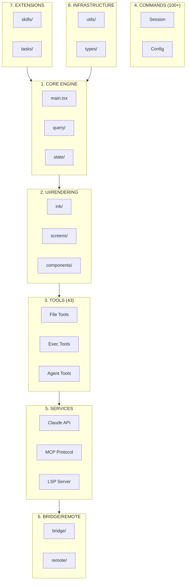
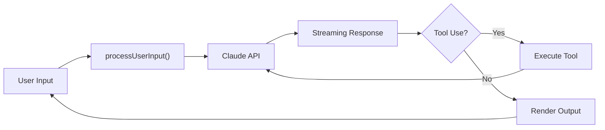

# Claude Code Architecture Diagrams

Interactive Mermaid.js visualization of Claude Code's 512K-line codebase.

> ⚠️ **Note**: GitHub README shows simplified overview diagrams only. For the **complete interactive visualization** with 81 Detail Panels and full architecture diagrams, please run the HTML file locally (see [Usage](#usage) below).

## 8 Systems Overview (Simplified)



## Query Loop Flow



## Files

| File | Description |
|------|-------------|
| [architecture-overview.html](architecture-overview.html) | Complete interactive visualization (100% coverage) |
| [COVERAGE-EVALUATION.md](COVERAGE-EVALUATION.md) | 127-item coverage tracking |

## Usage

```bash
# Start local server
npx serve .

# Open in browser
open http://localhost:3000/architecture-overview.html
```

## Coverage

| System | Items | Coverage |
|--------|-------|----------|
| Startup Flow | 12 | 100% |
| Query Loop | 10 | 100% |
| UI/Rendering | 11 | 100% |
| Tools System | 21 | 100% |
| Commands | 12 | 100% |
| Services | 18 | 100% |
| Bridge/Remote | 14 | 100% |
| Extensions | 10 | 100% |
| Infrastructure | 12 | 100% |
| **Total** | **127** | **100%** |

---
